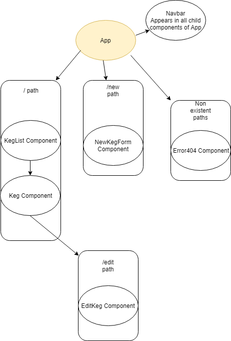

# _Tap Room React_

#### _Tap Room Website, 4.29.2019_

#### By _**Young Liu**_

## Description

_This website will allow users to manage a Tap room._

- _SPECS:_
  - _Users should be able to see a list of all available kegs._
  - _Users should be able to click on an individual keg to see its details, including its name, brand, price, and alcohol content._
  - _Users should be able to edit the properties of the keg by clicking on it._
  - _Users should be able to add a new keg with the specified details._
  - _Users should encounter an error message when visiting an invalid path._

## Setup/Installation Requirements

- _Clone this Repository (\$ git clone https://github.com/youngzliu/TapRoomReact name)_
- _Change into the work directory (\$ cd TapRoomReact)_
- _To edit the project, open the project in your preferred text editor._
- _To run the website, navigate to the directory of TapRoomReact, and then install and start ($ cd TapRoomReact; $ npm install; \$ npm run start)_
  - _Then navigate to http://localhost:8080 on your browser of choice._

## Prompt Questions

- _Unforeseen issues/questions_
  - _How to set an imported image as a global background image? The Jsx module styling doesn't allow for nested code (needed when referencing the import) and CSS objects don't seem to be able to apply the background image globally (only to the area the component renders). I had to force a min height on the image, which feels hacky._

* _Differences between Angular and React_
  - _Much easier to manage files in React without having 4 files to manage for each component._
    - _Although there isn't really much backend at the moment, purely front end stuff. So maybe it will become more complex later._

## Support and contact details

_For support find me at Epicodus._

## Technologies Used

_This website was created using Node.js, Node.js package manager, Webpack, and React._

### License

_MIT License_

_Copyright (c) 2019 Young Liu_

_Permission is hereby granted, free of charge, to any person obtaining a copy of this software and associated documentation files (the "Software"), to deal in the Software without restriction, including without limitation the rights to use, copy, modify, merge, publish, distribute, sublicense, and/or sell copies of the Software, and to permit persons to whom the Software is furnished to do so, subject to the following conditions:_

_The above copyright notice and this permission notice shall be included in all copies or substantial portions of the Software._

_THE SOFTWARE IS PROVIDED "AS IS", WITHOUT WARRANTY OF ANY KIND, EXPRESS OR IMPLIED, INCLUDING BUT NOT LIMITED TO THE WARRANTIES OF MERCHANTABILITY, FITNESS FOR A PARTICULAR PURPOSE AND NONINFRINGEMENT. IN NO EVENT SHALL THE AUTHORS OR COPYRIGHT HOLDERS BE LIABLE FOR ANY CLAIM, DAMAGES OR OTHER LIABILITY, WHETHER IN AN ACTION OF CONTRACT, TORT OR OTHERWISE, ARISING FROM, OUT OF OR IN CONNECTION WITH THE SOFTWARE OR THE USE OR OTHER DEALINGS IN THE SOFTWARE._
